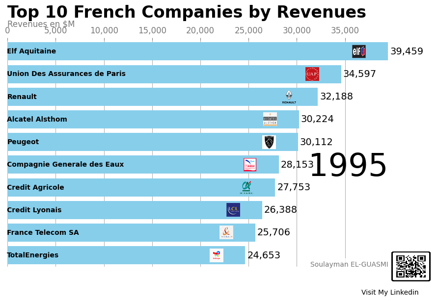

# Entreprises françaises par chiffre d'affaires 1995-2023
 

## Introduction :

-  Ce projet vise à illustrer l'évolution des 10 premières entreprises françaises en termes de revenus de 1995 à 2023.
-  Le graphique animé permet de visualiser les changements dans le classement des entreprises au fil des années, en mettant en évidence les secteurs dominants. 
-  En observant ce graphique, on peut identifier les entreprises qui ont connu une croissance significative ainsi que les secteurs économiques qui ont dominé en termes de revenus au cours des dernières décennies. 
-  Cette visualisation dynamique offre une perspective claire et engageante sur l'évolution économique et sectorielle en France.

## Références :

- Sources :
    - Lien vers le site Forune : <a href="https://fortune.com/ranking/global500/1995/search/?hqcountry=France">Fortune 500 </a>
    - Lien vers le dataset des top_10 sociétés française : <a href="https://github.com/SouLayman2022/France_Top10_By_Year/blob/main/France_TOP10_Companies_1995_2023.csv">France_Top10_By_Year</a>

- My-links :
    - Git_hub : <a href="https://github.com/SouLayman2022/Blood_cells_Classification.git">Repo GitHub</a>
    - linked_in : <a href="https://www.linkedin.com/in/soulayman-el-guasmi-13b890240/">Linkedin page</a>
    - Get to know me ! <a href="https://soulayman2022.github.io/Data_Scientist_Portfolio/">My Portfolio page</a>